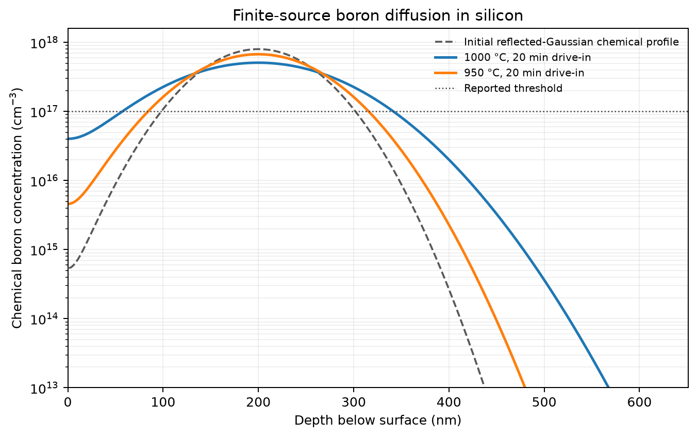
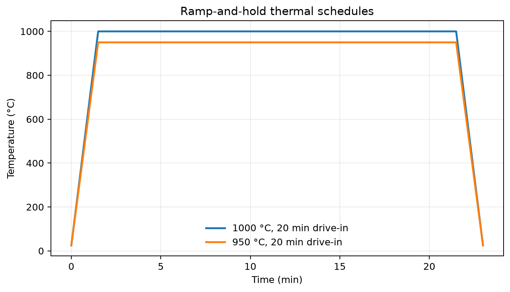
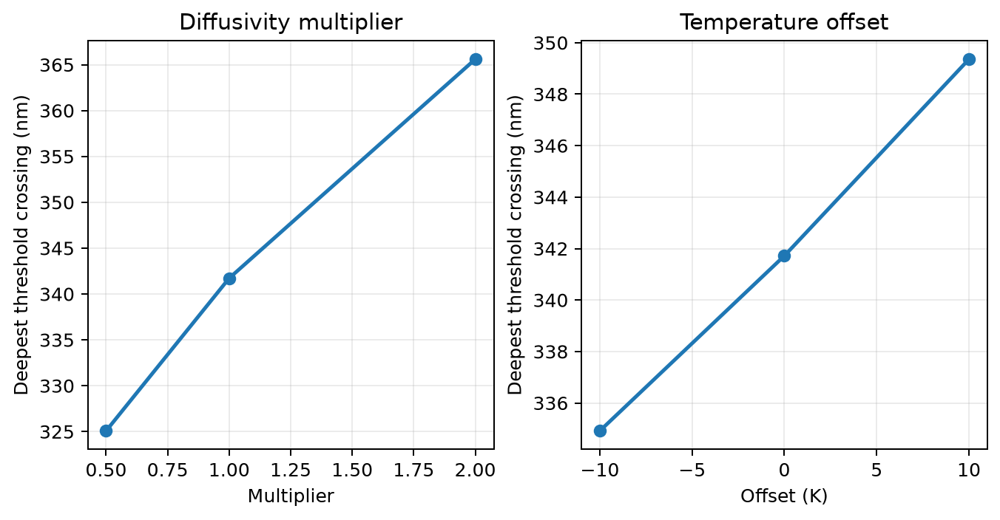

# Dopant Diffusion and Thermal-Budget Simulation

**A conservative, reproducible one-dimensional Python simulator for chemical boron diffusion in silicon during ramp-and-hold thermal processes.**

The package turns a declared thermal schedule and dose-limited initial profile into concentration-depth data, dose-balance diagnostics, threshold crossings, reports, and publication-oriented figures. It is a transparent educational process model—not a calibrated industrial TCAD tool.

## Why this project

Thermal processing redistributes dopants and thereby influences shallow-junction formation, sheet resistance, and process-integration windows. This project makes the temperature-time history explicit through its **thermal budget**, then solves the corresponding one-dimensional diffusion problem conservatively.

The tracked case study is synthetic model output. It is **not** wafer data, an implant measurement, or a prediction calibrated to a particular furnace. The reported quantity is chemical boron concentration, not electrically active dopant density or carrier concentration.

## Model

For spatially uniform, temperature-dependent chemical diffusivity, the concentration $C(x,t)$ obeys Fick's second law:

$$
\frac{\partial C}{\partial t} =
\frac{\partial}{\partial x}\left[D(T)\frac{\partial C}{\partial x}\right].
$$

The V1 boron-in-silicon model uses the configurable Arrhenius form

$$
D(T)=D_0\exp\left(-\frac{E_a}{k_B T}\right),
\qquad
\Theta=\int_0^{t}D[T(\tau)]\,d\tau,
$$

where $x$ is depth (m), $t$ is time (s), $C$ is chemical concentration (m$^{-3}$), $D$ is diffusivity (m$^2$ s$^{-1}$), $T$ is absolute temperature (K), and $\Theta$ is the integrated diffusivity (m$^2$). The default inputs $D_0=0.76\ \mathrm{cm^2\,s^{-1}}$ and $E_a=3.46\ \mathrm{eV}$ are representative dilute-Fickian values, exposed as inputs rather than universal constants.

Read the full [physical model, units, boundary conditions, and assumptions](docs/MODEL.md).

## Features

- Piecewise-linear ramp-and-hold schedules with numerical thermal-budget integration.
- Cell-centred finite-volume discretisation and backward-Euler stepping in $\Theta$, solved with SciPy sparse linear algebra.
- Finite-source, zero-flux simulations from a dose-normalised reflected Gaussian.
- Fixed-surface-concentration boundary support and complementary-error-function reference solution.
- Unit-labelled JSON/CSV reports, including all concentration-threshold crossings and dose-balance error.
- Config-driven CLI and a reproducible synthetic process comparison.
- Declared sensitivity studies for Arrhenius diffusivity multipliers and schedule temperature offsets; these are not probabilistic uncertainty intervals.

## Reproduced V1 case study

The script below compares the same finite source after 20-minute peak holds at 1000 °C and 950 °C, with 90-second linear ramps. It evaluates a 2 µm, 800-cell domain and reports a chemical-concentration threshold of $10^{17}\ \mathrm{cm^{-3}}$.

| Case | Thermal budget $\Theta$ (m²) | Reported threshold crossings (nm) |
| --- | ---: | ---: |
| 1000 °C, 20 min | $1.845357\times10^{-15}$ | 57.19, 341.72 |
| 950 °C, 20 min | $5.083152\times10^{-16}$ | 84.21, 315.79 |

For this non-monotonic finite-source profile, a threshold can have two crossings. The deepest crossing is a transparent descriptive metric in the sensitivity plot; it is not automatically a physical electrical junction depth.

Full machine-readable outputs are versioned in [reports/](reports/), with the tracked configuration in [examples/boron_ramp_hold.json](examples/boron_ramp_hold.json).

## Validation

The numerical solver is independently checked at constant diffusivity against analytical semi-infinite solutions and against finite-volume balance relationships.

| Check | Result |
| --- | ---: |
| Reflected-Gaussian reference, relative L2 error | $1.3647\times10^{-4}$ |
| Finite-source relative dose-balance error | $6.4\times10^{-14}$ |
| Constant-surface erfc reference, relative L2 error | $1.8656\times10^{-4}$ |
| Fixed-surface relative flux-balance error | $6.02\times10^{-13}$ |

The tests also verify mesh/time refinement and invalid-input handling. A 2 µm validation domain was rejected after the far no-flux boundary measurably contaminated the semi-infinite Gaussian benchmark; the validated comparison uses a 4 µm domain. Details and limits are in [docs/VALIDATION.md](docs/VALIDATION.md).

## Installation

Python 3.11 or newer is required. From a clone of this repository:

~~~bash
python -m venv .venv
source .venv/bin/activate  # Windows PowerShell: .venv\Scripts\Activate.ps1
python -m pip install --upgrade pip
python -m pip install -e '.[dev,plots]'
~~~

The base package requires NumPy and SciPy. The plots extra installs Matplotlib; the dev extra installs pytest, Ruff, and build tools.

## Usage

Regenerate the tracked figures and reports:

~~~bash
python examples/reproduce.py
~~~

Run the public CLI on the documented finite-source configuration:

~~~bash
dopant-diffusion examples/boron_ramp_hold.json --output-dir outputs/boron --plots
~~~

This writes a unit-labelled report JSON, a depth-profile CSV, and (with --plots) profile.png and schedule.png. The configuration schema deliberately uses SI names such as temperature_K, dose_m2, projected_range_m, and threshold_m3.

The core API is also small and reusable:

~~~python
from dopant_diffusion import BoronInSilicon, SpatialGrid, solve_diffusion
from dopant_diffusion.profiles import reflected_gaussian_m3
from dopant_diffusion.thermal import ThermalSchedule, ThermalSegment

grid = SpatialGrid(length_m=2.0e-6, cells=800)
schedule = ThermalSchedule((ThermalSegment(1273.15, 1273.15, 1200.0),))
initial = reflected_gaussian_m3(grid.centres_m, 1.0e17, 2.0e-7, 5.0e-8)
result = solve_diffusion(initial, grid, schedule, BoronInSilicon())
~~~

## Development checks

~~~bash
python -m pytest -q
python -m ruff check .
python -m ruff format --check .
python -m build
~~~

## Project structure

~~~text
src/dopant_diffusion/   reusable physical models, solver, diagnostics, workflow, CLI and plots
tests/                  analytical, conservation, convergence and workflow tests
examples/               JSON input and reproducibility script
figures/                regenerated synthetic V1 figures
reports/                regenerated unit-labelled synthetic V1 outputs
docs/                   model, validation and recovery/progress documentation
~~~

## Assumptions and limitations

- One-dimensional chemical diffusion only; no activation or carrier-statistics calculation.
- Spatially uniform dilute-Fickian $D(T)$; no concentration dependence, point defects, clustering, transient-enhanced diffusion, segregation, or oxidation effects.
- A reflected Gaussian is a transparent dose-limited initial condition, not an ion-implant damage simulator.
- The examples are synthetic model studies. They do not constitute experimental validation or industrial process calibration.
- A finite computational domain approximates semi-infinite analytical cases only when boundary effects are demonstrated negligible.

## Future work

Possible extensions include calibrated concentration-dependent diffusion, activation models, oxidation/segregation, 2D geometry, real process metrology comparison, and uncertainty propagation based on measured process inputs. These are intentionally outside V1.

## References

1. S. M. Sze and K. K. Ng, *Physics of Semiconductor Devices*, 3rd ed., Wiley, 2007.
2. S. Wolf and R. N. Tauber, *Silicon Processing for the VLSI Era, Vol. 1*, 2nd ed., Lattice Press, 2000.
3. J. Crank, *The Mathematics of Diffusion*, 2nd ed., Oxford University Press, 1975.

## License and development note

Released under the [MIT License](LICENSE). This portfolio project was developed with AI assistance; its claims are limited to the code, documentation, and reproducible checks included here.
